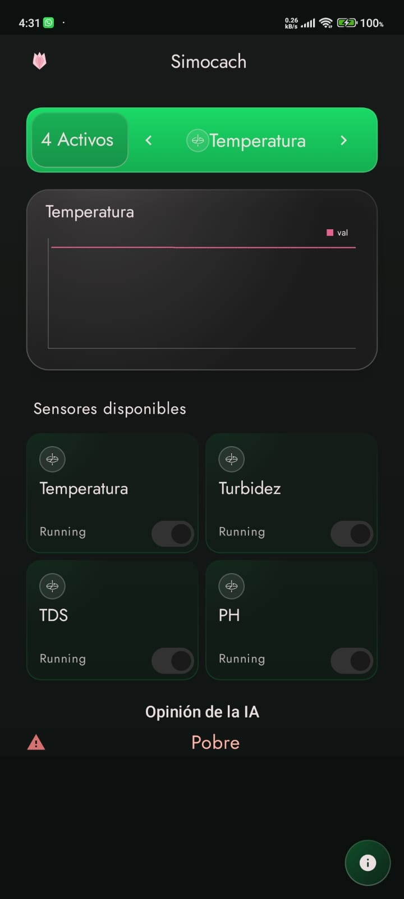
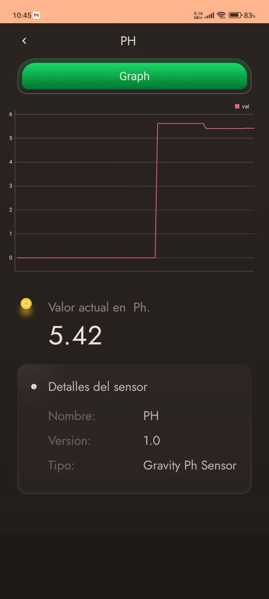
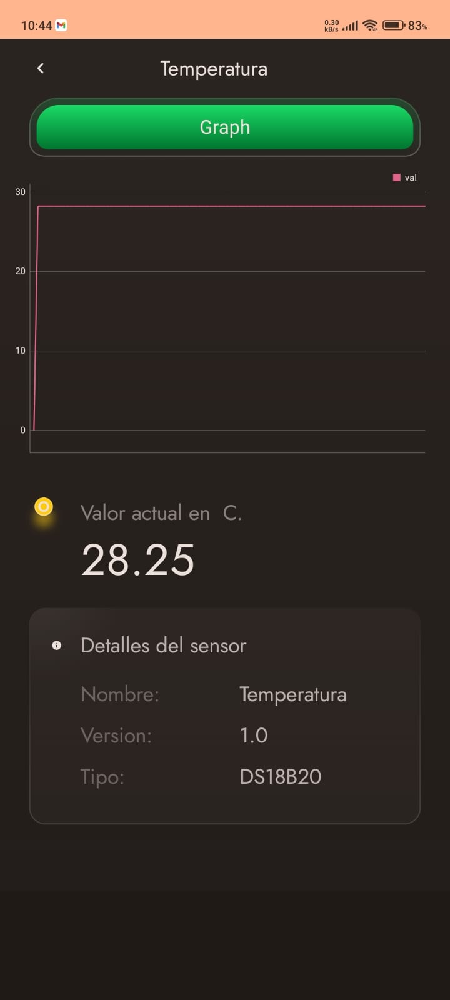
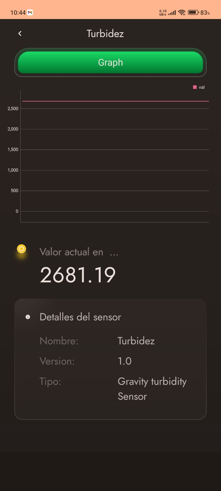

# SIMOCACH

## Descripción
This is an app (Only Frontend) that shows data graphs from water quality sensors such as Temperature, TDS, pH and Turbidity obtained from an IOT device and exposing its quality through the opinion given by our AI model.

## Tecnologías

- **Framework:** Kotlin and Java  
- **APi:** Api DJango  

## Funcionalidades principales

📊 Gráficos interactivos de temperatura, TDS, pH y turbidez (MPAndroidChart).

🔄 Actualización en tiempo real por MQTT / WebSockets.

🤖 Clasificación IA de calidad del agua.

🌐 Soporte offline con cache local y sincronización posterior.

## Capturas de pantalla
<table>
  <tr>
    <td>
      
    </td>
    <td>
      
    </td>
  </tr>
  <tr>
    <td>
      
    </td>
    <td>
      
    </td>
  </tr>
</table>

---

## Instalación y uso

git clone https://github.com/wiljean2001/Simocach.git
cd Simocach

Open Android Studio (requiere AGP 8.4.0 y Kotlin 1.9.0).

Sync And Strart build

---

## Autor

Wilmer Jean Pierre Ayala García  
[LinkedIn](https://linkedin.com/in/wilmer-ayala-garcia) | [GitHub](https://github.com/wiljean2001)
